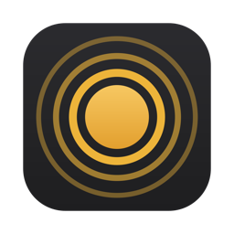

<p align="center">
  
</p>

<h1 align="center">Rhemion</h1>

<p align="center"><strong>Thought, uninterrupted.</strong><br>Hold a key and speak. Your Mac does the typing.</p>

<p align="center">
  <a href="https://github.com/sageathor/rhemion/releases/latest">Download</a> ·
  <a href="#install">Install</a> ·
  <a href="docs/usage.md">Usage</a> ·
  <a href="PRIVACY.md">Privacy</a> ·
  <a href="docs/troubleshooting.md">Troubleshooting</a>
</p>

## Why Rhemion

Most of us think faster than we type. A long prompt for an AI assistant, an email, the context for a task: saying it takes seconds, typing it takes minutes, and part of the thought gets lost on the way.

Rhemion lives in the menu bar. Hold a key, say what you mean, let go, and the text is where your cursor is, usually in about half a second. It works in chat apps, code editors, browsers, mail and notes. Speech is recognized on your Mac, so your words go only where you send them, and there is no account or subscription.

The name comes from *rhēma*, Greek for the spoken word.

## What it does

- **Push-to-talk.** Right Command by default. Choose another key, or add several; any of them starts dictation.
- **Hands-free.** Double-tap the key to keep recording, tap once to stop. After a long silence it stops on its own.
- **Undo in one gesture.** Double-tap Esc to cancel a recording or to erase the text just inserted.
- **On-device recognition.** NVIDIA Parakeet v3 running on your Mac through [FluidAudio](https://github.com/FluidInference/FluidAudio). The model (about 460 MB) is downloaded once.
- **Dictionary.** Teach it the words it keeps getting wrong: "Spoken as → Replace with". Add a word from a selection with ⌥⌘W; undo a replacement with ⇧⌥⌘L.
- **Recall.** ⌥⌘R inserts the last dictation again.
- **Journal.** Every dictation in one searchable list: copy it, replay it while the audio is kept, delete it. Optionally export transcripts to a folder of Markdown files, one per month.
- **Your data, your call.** Clear Data removes exactly what you choose. Uninstall removes Rhemion and lets you keep the data you want.

## Requirements

- macOS 15 Sequoia or later
- A Mac with Apple Silicon (M1 or later)
- About 500 MB of free space for the app and the speech model
- An internet connection once, to download the speech model

## Install

Rhemion is signed with its own certificate but is **not notarized by Apple**, which requires a paid Apple Developer membership. macOS therefore asks you to confirm it once, on first launch.

1. Download `Rhemion-3.0.0.zip` from the [latest release](https://github.com/sageathor/rhemion/releases/latest).
2. Open the ZIP and move `Rhemion.app` to the **Applications** folder. Launch it from there, not from Downloads.
3. Open Rhemion. macOS reports that it cannot verify the app. Click **Done**.
4. Open **System Settings › Privacy & Security**, scroll to **Security**, click **Open Anyway** next to the Rhemion message, and confirm with your password or Touch ID.
5. The Welcome window opens. Grant the two permissions it asks for and download the speech model.

On macOS 15 and later, Control-click › Open no longer skips this check, so use **Open Anyway** as above. More help: [Troubleshooting](docs/troubleshooting.md).

### Permissions

| Permission | Why |
|---|---|
| Accessibility | To notice the dictation key in any app, insert text into the focused field, and read a selection for the dictionary. |
| Microphone | To hear you while you dictate. macOS may list it twice: for Rhemion and for its built-in helper `rhemion-runtime`, which records the audio. |

Rhemion uses them for nothing else. See [PRIVACY.md](PRIVACY.md).

### Verify the download (optional)

Each release lists the SHA-256 checksum of the ZIP. In Terminal:

```sh
shasum -a 256 ~/Downloads/Rhemion-3.0.0.zip
```

The output must match the checksum on the release page.

## Update

Rhemion does not update itself yet. To update, quit Rhemion (menu bar icon › **Quit Rhemion**, or ⌥⌘Q), replace `Rhemion.app` in Applications with the new version, and open it. Permissions are kept, because every release is signed with the same certificate. To hear about new versions, watch the repository (**Watch › Custom › Releases**). The version you have is in menu bar icon › **About Rhemion**.

## Uninstall

In Rhemion, open **Settings › Advanced › Storage › Uninstall…** and choose what to keep: dictionary, journal, exported transcripts. Rhemion removes the rest, its login item and its permission entries, then moves itself to the Trash.

If the app is already in the Trash or does not start, download [`uninstall.sh`](deploy/uninstall.sh) and run it in Terminal:

```sh
bash ~/Downloads/uninstall.sh
```

It asks what to do:

- **Keep my data** (`--keep-data`) removes the app, its settings, caches and permission entries, and keeps your dictionary, journal, recordings and the speech model.
- **Erase my data** (`--purge`) also removes your dictionary, journal and recordings, and asks whether to remove the speech model too (`--purge-model` removes it without asking).

Exported transcripts are never touched. A script cannot remove the login item: if "Rhemion" is still listed in **System Settings › General › Login Items**, remove it there.

## Privacy

Audio is recorded and recognized on your Mac and is not sent anywhere. Rhemion goes online only to download the speech model from Hugging Face, and it has no analytics. Details: [PRIVACY.md](PRIVACY.md).

## Build from source

See [BUILDING.md](BUILDING.md).

## Contributing

Bug reports and focused pull requests are welcome; see [CONTRIBUTING.md](CONTRIBUTING.md). Please report security issues as described in [SECURITY.md](SECURITY.md), not in public issues.

## License

[MIT](LICENSE) © 2026 Sageathor. Third-party components and the speech model are credited in [THIRD_PARTY_NOTICES.md](THIRD_PARTY_NOTICES.md).
